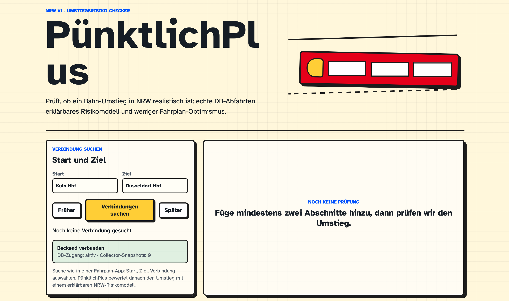
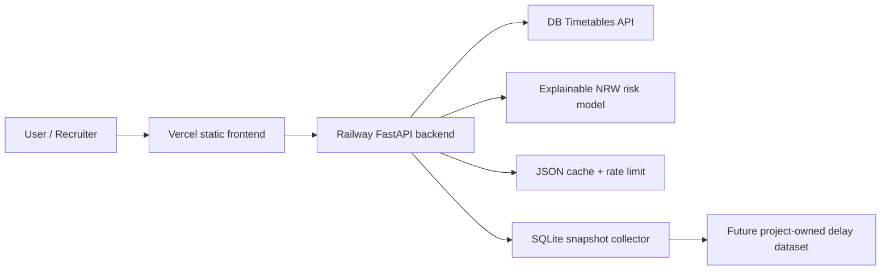

# PünktlichPlus

[](https://puenktlichplus.vercel.app/)
[](https://puenktlichplus-production.up.railway.app/health)
[](https://fastapi.tiangolo.com/)
[](https://vercel.com/)

PünktlichPlus is an Umstiegsrisiko-Checker for Deutsche Bahn trips in NRW. It combines live DB Timetables data with an explainable delay-risk model to answer one practical question: is this transfer actually realistic, or only realistic on paper?

The point is deliberately practical: a recruiter should see real API integration, caching/rate limiting, data modeling, clean backend architecture, and an honest explanation of what the system can and cannot know.

The UI is German-only for v1 because the target use case is a German railway portfolio demo.

Live demo: [puenktlichplus.vercel.app](https://puenktlichplus.vercel.app/)

## Screenshot



## What It Does

- Lets users type a start and destination station, similar to a normal journey app.
- Searches live DB Timetables station boards for direct and one-transfer NRW connection candidates.
- Lets users choose a connection card before calculating the risk verdict.
- Calculates the planned transfer buffer between two legs.
- Estimates the probability of missing the connection from an explainable delay distribution.
- Shows a clear German verdict first: safe, tight, risky, or invalid.
- Shows arrival windows as supporting evidence instead of pretending one exact minute is scientific.
- Includes a snapshot collector that can build a project-owned DB timetable history over time.
- Keeps the data layer, DB cache/rate limit, model, transfer-risk logic, and API separate.

## Data Feasibility Check

DB's public Open Data page says the old portal moved on March 10, 2024 and that DB APIs remain available through the [DB API Marketplace](https://developers.deutschebahn.com/db-api-marketplace/apis/). It specifically describes the [Timetables API](https://developers.deutschebahn.com/db-api-marketplace/apis/product/timetables) as a way to query current timetable slices and current deviations from the planned timetable.

The Timetables product currently lists a free plan with 60 calls per minute and endpoints such as `/station/{pattern}`, `/plan/{evaNo}/{date}/{hour}`, `/fchg/{evaNo}`, and `/rchg/{evaNo}`. The Marketplace getting-started guide says registration, an application, a client id, and an API key are required.

Important limitation: this is not a free historical per-route delay archive. For v1, PünktlichPlus uses DB Timetables for live station lookup and near-term departures, then uses a representative NRW dataset in `backend/app/data/nrw_delay_observations.csv` for transfer-risk modeling. That separation is intentional and documented in the API response.

The backend protects DB's free quota with local JSON caching and a conservative 20-calls-per-minute app-side rate limit, below DB's listed 60-calls-per-minute free plan.

## Architecture



```text
backend/
  app/main.py                    FastAPI routes
  app/services/data_source.py    CSV repository and DB Timetables adapter
  app/services/delay_model.py    Explainable delay distribution model
  app/services/connection_risk.py Transfer miss probability
  app/services/cache.py          Local JSON cache for external API calls
  app/services/collector.py      SQLite snapshot collector for future historical data
  app/services/rate_limit.py     App-side DB quota protection
  collect_snapshots.py           CLI entry point for scheduled collection
frontend/
  index.html                     Static app shell
  styles.css                     Design tokens and sketch-like UI
  app.js                         Itinerary form and API rendering
  config.js                      Runtime API base URL
```

Python/FastAPI is used because the core work is data-heavy and the modeling code should stay interview-readable. The frontend is static HTML/CSS/JS so it can deploy cheaply to GitHub Pages, Netlify, or Vercel while the backend runs separately on a free-tier Python host.

## Run Locally

```bash
cd backend
python3 -m venv .venv
source .venv/bin/activate
pip install -r requirements.txt
uvicorn app.main:app --reload
```

Then open `frontend/index.html` in a browser. For deployed frontend builds, set:

```js
// frontend/config.js
window.PUENKTLICHPLUS_API_BASE = "https://your-railway-backend.up.railway.app";
```

## Data Collector

The collector stores DB Timetables station-board snapshots in SQLite. It is not used as the main model yet, but it creates the path toward a real project-owned historical dataset.

```bash
cd backend
source .venv/bin/activate
python collect_snapshots.py
```

Configure stations with:

```bash
COLLECTOR_STATIONS=Köln Hbf,Düsseldorf Hbf,Duisburg Hbf,Essen Hbf,Dortmund Hbf,Bonn Hbf
```

The collector writes to `backend/app/data/collector.sqlite`, which is intentionally ignored by Git.

On Railway, the normal filesystem should be treated as ephemeral. For long-running production collection, attach a Railway Volume or move the collector store to a hosted database such as Postgres. The current SQLite collector is intentionally simple for a portfolio demo and local experimentation.

## Optional DB Credentials

Create a free DB API Marketplace account, create an application, subscribe to the free Timetables plan, then set:

```bash
DB_CLIENT_ID=...
DB_API_KEY=...
FRONTEND_ORIGINS=http://127.0.0.1:5173,http://localhost:5173
```

The current model does not claim those calls as historical training data. They are used for station suggestions and live connection candidates. DB Timetables does not provide a full DB Navigator-style journey-planner response here, so PünktlichPlus builds lightweight NRW candidates from station boards: direct trains first, then one-transfer searches through common NRW hubs. Arrival times are estimated locally for the prediction workflow.

## Deployment

Recommended split:

- Railway for the FastAPI backend.
- Vercel for the static frontend.

### Railway Backend

Deploy the `backend/` folder as the Railway service root. Set these environment variables:

```bash
DB_CLIENT_ID=...
DB_API_KEY=...
FRONTEND_ORIGINS=https://your-vercel-app.vercel.app
COLLECTOR_STATIONS=Köln Hbf,Düsseldorf Hbf,Duisburg Hbf,Essen Hbf,Dortmund Hbf,Bonn Hbf
```

The backend includes `backend/railway.json` and `backend/Procfile`; the start command is:

```bash
uvicorn app.main:app --host 0.0.0.0 --port $PORT
```

### Vercel Frontend

Deploy the `frontend/` folder as a static Vercel project. After Railway gives you the backend URL, update:

```js
// frontend/config.js
window.PUENKTLICHPLUS_API_BASE = "https://your-railway-backend.up.railway.app";
```

Then redeploy the frontend.

### Scheduled Collector

For a first live demo, running the collector manually is enough. Later, add a Railway cron/service that runs:

```bash
python collect_snapshots.py
```

Those snapshots can become the training/evaluation dataset for a future model iteration.

## Resume Pitch

> Built PünktlichPlus, a FastAPI/JavaScript web app that integrates Deutsche Bahn's Timetables API, caches and rate-limits upstream calls, and uses an explainable statistical model to estimate NRW train transfer-miss risk.

## Testing

```bash
cd backend
pytest
```

The tests cover the explainable prediction window, station-name normalization, DB XML parsing, the snapshot store, and transfer-risk calculation. `backend/app/data/validation_cases.json` contains small validation cases for portfolio discussion.

## Limitations

- v1 is NRW-only.
- The sample dataset is representative, not official DB historical ground truth.
- The collector starts empty; it becomes useful after repeated runs over time.
- DB Timetables is used for station boards, not full official journey planning.
- Connection search supports direct and one-transfer NRW candidates, not arbitrary nationwide routing.
- Delay distributions are grouped statistics, not a black-box ML model.
- The model does not yet account for weather, construction works, rolling stock, cancellations, or platform changes.
- Transfer risk assumes the next train leaves according to its planned departure time.

Those limitations are not hidden because the engineering value here is showing a trustworthy system, not overselling a demo.
